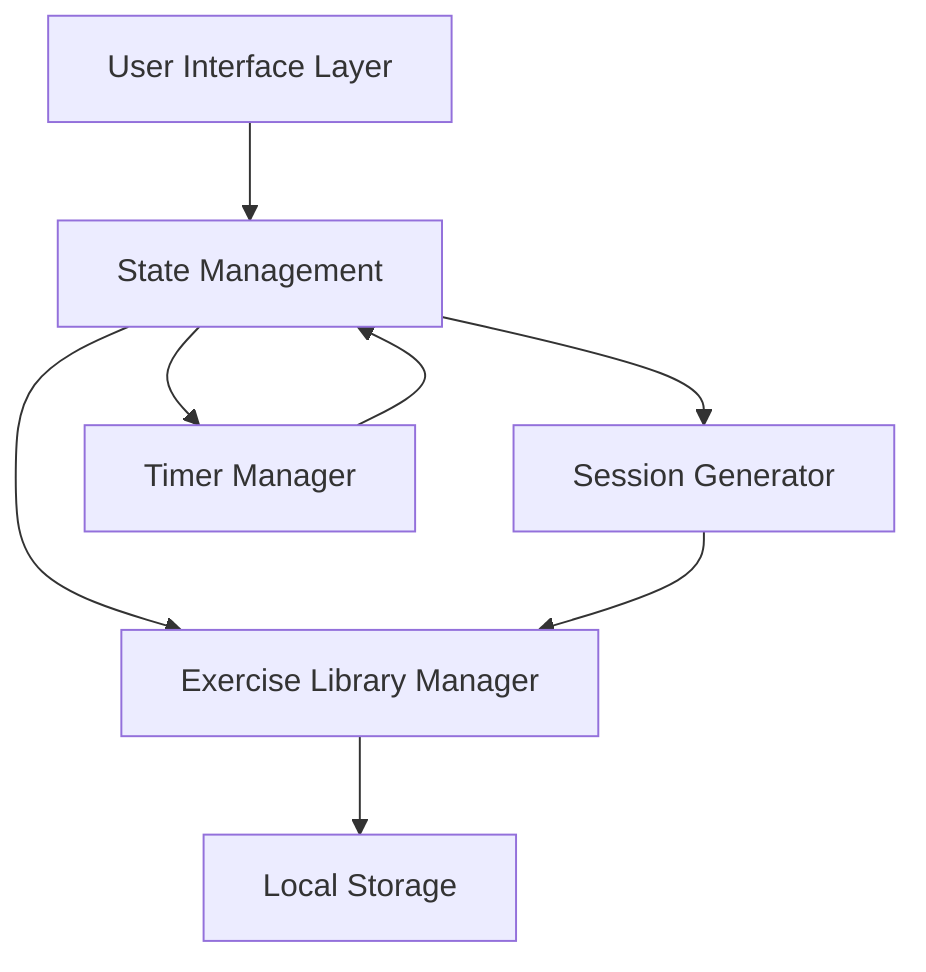

# Design Document: Exercise Timer App

## Overview

The Exercise Timer App is a client-side web application that provides guided workout sessions with automatic exercise sequencing and timing. The application runs entirely in the browser without requiring a backend server, using browser local storage for data persistence.

### Key Design Principles

1. **Client-Only Architecture**: All functionality runs in the browser with no server dependencies
2. **Local Data Persistence**: Exercise library stored in browser local storage
3. **Responsive Design**: Works across mobile, tablet, and desktop devices
4. **Weighted Time Distribution**: Exercises receive time proportional to their difficulty weights
5. **Maximum Variety**: Exercises cycle through the entire library before repeating

### Technology Stack

- **Language**: ClojureScript
- **Build Tool**: shadow-cljs
- **Frontend Framework**: Reagent (ClojureScript wrapper for React)
- **Storage**: Browser LocalStorage API (via js interop)
- **Styling**: CSS with responsive design (flexbox/grid)
- **State Management**: Reagent atoms (reactive state)

## Architecture

### High-Level Architecture



### Component Layers

1. **User Interface Layer**: Reagent components for display and interaction
2. **State Management**: Reagent atoms for reactive state
3. **Business Logic Layer**: 
   - Exercise Library Manager: CRUD operations for exercises
   - Session Generator: Creates weighted exercise sequences
   - Timer Manager: Handles countdown and state transitions
4. **Storage Layer**: LocalStorage wrapper (via js interop) for persistence

## Components and Interfaces

### 1. Exercise Library Manager

**Responsibility**: Manage the collection of exercises with persistence

**Interface**:
```clojure
;; Exercise data structure
(defn make-exercise [name weight]
  {:name name
   :weight weight})

;; Exercise Library Manager namespace
(ns exercise-timer.library)

(defn load-library []
  "Load exercises from local storage, returns vector of exercises")

(defn save-library! [exercises]
  "Save exercises to local storage")

(defn add-exercise! [exercise]
  "Add a new exercise, returns {:ok true} or {:error \"message\"}")

(defn get-all-exercises []
  "Get all exercises from current state")

(defn exercise-exists? [name]
  "Check if exercise name exists in library")

(defn export-to-json []
  "Export library as JSON string")

(defn import-from-json [json-str]
  "Import library from JSON with merge, returns {:added [...] :conflicts [...]}")

(defn initialize-defaults! []
  "Initialize library with default exercises")
```

**Default Exercises**:
- Push-ups (weight: 1.2)
- Squats (weight: 1.0)
- Plank (weight: 1.5)
- Jumping Jacks (weight: 0.8)
- Lunges (weight: 1.0)
- Mountain Climbers (weight: 1.3)
- Burpees (weight: 1.8)
- High Knees (weight: 0.9)
- Sit-ups (weight: 1.0)
- Wall Sit (weight: 1.4)

### 2. Session Generator

**Responsibility**: Generate exercise sequences with weighted time distribution

**Interface**:
```clojure
(ns exercise-timer.session)

(defn generate-session [config exercises]
  "Generate a session plan from configuration and exercise library
   config: {:duration-minutes int}
   exercises: vector of exercise maps
   returns: {:exercises [{:exercise {...} :duration-seconds int}]
             :total-duration-seconds int}")
```

**Algorithm**:
1. Determine number of exercises (one or more, based on duration and user preference)
2. Select exercises using round-robin without repetition until all library exercises used
3. Calculate base time per exercise: `totalSeconds / sum(weights)`
4. Assign time to each exercise: `baseTime * exercise.weight`
5. Distribute any remaining seconds due to rounding to exercises proportionally

### 3. Timer Manager

**Responsibility**: Manage countdown timer and exercise progression

**Interface**:
```clojure
(ns exercise-timer.timer)

;; Session states: :not-started :running :paused :completed

(defn start! []
  "Start or resume the timer")

(defn pause! []
  "Pause the timer")

(defn restart! []
  "Reset to beginning")

(defn get-state []
  "Get current timer state
   returns: {:current-exercise-index int
             :remaining-seconds int
             :session-state keyword}")

(defn next-exercise! []
  "Advance to next exercise")

(defn on-tick [callback]
  "Register callback for timer tick (every second)")

(defn on-exercise-change [callback]
  "Register callback for exercise change")

(defn on-complete [callback]
  "Register callback for session complete")
```

**Timer Implementation**:
- Uses `js/setInterval` with 1000ms interval
- Decrements `remaining-seconds` each tick
- When reaching 0, advances to next exercise or completes session
- Clears interval when paused or completed

### 4. State Management

**Responsibility**: Central application state using Reagent atoms

**State Structure**:
```clojure
;; Global app state atom
(defonce app-state
  (reagent/atom
    {:exercises []                    ; Exercise library
     :current-session nil             ; Current session plan or nil
     :timer-state {:current-exercise-index 0
                   :remaining-seconds 0
                   :session-state :not-started}
     :ui {:show-add-exercise false
          :show-import-dialog false
          :import-conflicts nil}}))
```

### 5. UI Components

**Main Components** (Reagent components):

1. **app**: Root component
2. **configuration-panel**: Set session duration, start session
3. **exercise-display**: Show current exercise, progress (X of Y)
4. **timer-display**: Show countdown in MM:SS format
5. **control-panel**: Pause/Resume/Restart buttons
6. **exercise-library-panel**: View, add, import, export exercises
7. **add-exercise-dialog**: Form to add new exercise
8. **import-conflict-dialog**: Resolve import conflicts
9. **completion-screen**: Show when session completes

## Data Models

### Exercise

```clojure
{:name "Push-ups"     ; Unique identifier and display name
 :weight 1.2}         ; Time multiplier: 0.5 to 2.0
```

**Validation Rules**:
- `name`: Non-empty string, unique within library
- `weight`: Number between 0.5 and 2.0 inclusive

### Session Plan

```clojure
{:exercises [{:exercise {:name "Push-ups" :weight 1.2}
              :duration-seconds 45}
             {:exercise {:name "Squats" :weight 1.0}
              :duration-seconds 38}]
 :total-duration-seconds 300}
```

**Invariants**:
- `exercises.length >= 1`
- `sum(exercises.map(e => e.durationSeconds)) === totalDurationSeconds`
- No consecutive duplicate exercises
- Exercises cycle through library before repeating

### Local Storage Schema

**Key**: `exercise-timer-library`

**Value** (JSON):
```json
{
  "version": 1,
  "exercises": [
    {
      "name": "Push-ups",
      "weight": 1.2
    }
  ]
}
```

## Correctness Properties

*A property is a characteristic or behavior that should hold true across all valid executions of a system—essentially, a formal statement about what the system should do. Properties serve as the bridge between human-readable specifications and machine-verifiable correctness guarantees.*


### Property 1: Session Configuration Round-Trip
*For any* positive integer representing minutes, when a user submits it as session duration, the system should store it and convert it to seconds (minutes × 60) for internal processing.
**Validates: Requirements 1.1, 1.2, 1.3**

### Property 2: Minimum Exercise Count
*For any* valid session configuration, the generated exercise sequence should contain at least one exercise.
**Validates: Requirements 2.1**

### Property 3: Exercise Library Membership
*For any* generated exercise sequence, all exercises in the sequence should exist in the exercise library.
**Validates: Requirements 2.2**

### Property 4: No Repetition Until Library Exhausted
*For any* generated exercise sequence, if an exercise appears twice in the sequence, then all exercises from the library must have appeared between the first and second occurrence.
**Validates: Requirements 2.3**

### Property 5: Time Conservation
*For any* generated session plan, the sum of all individual exercise durations should equal the total session duration in seconds.
**Validates: Requirements 2.5**

### Property 6: Display Required Information
*For any* active exercise session, the display should contain the current exercise name, current exercise number, and total number of exercises.
**Validates: Requirements 3.1, 3.2**

### Property 7: Timer Countdown Behavior
*For any* exercise, when it begins, the timer should start at the exercise's calculated duration and decrement by 1 each second while running.
**Validates: Requirements 4.1, 4.2**

### Property 8: Exercise Advancement
*For any* exercise in a session, when its timer reaches zero and it's not the final exercise, the system should advance to the next exercise (index + 1).
**Validates: Requirements 4.3**

### Property 9: Session Completion
*For any* session, when the final exercise's timer reaches zero, the session state should transition to 'completed'.
**Validates: Requirements 4.4**

### Property 10: Time Format Validation
*For any* number of seconds, the displayed time format should match the pattern MM:SS where MM is zero-padded minutes and SS is zero-padded seconds.
**Validates: Requirements 4.5**

### Property 11: Pause Preserves State
*For any* running session, pausing should preserve the current exercise index and remaining time, and resuming should restore exactly that state.
**Validates: Requirements 5.2, 5.4**

### Property 12: Restart Resets Session
*For any* session (regardless of current state), restarting should reset the exercise index to 0 and the timer to the first exercise's duration.
**Validates: Requirements 5.5**

### Property 13: Exercise Data Integrity
*For any* exercise library state, all exercises should have a unique name and a weight value, and all names should be distinct.
**Validates: Requirements 6.2, 6.4**

### Property 14: Weight Validation
*For any* weight value, the system should accept it if and only if it's between 0.5 and 2.0 inclusive.
**Validates: Requirements 6.3**

### Property 15: Storage Round-Trip
*For any* exercise library, loading from storage after saving should produce an equivalent library.
**Validates: Requirements 6.5**

### Property 16: Add Exercise Validation
*For any* exercise addition attempt, it should succeed if and only if the name is non-empty, the weight is between 0.5 and 2.0, and no exercise with that name already exists in the library.
**Validates: Requirements 7.2, 7.3, 7.4**

### Property 17: Add Exercise Persistence
*For any* successfully added exercise, it should immediately appear in both the in-memory library and local storage.
**Validates: Requirements 7.5, 7.6**

### Property 18: Session State Validity
*For any* active session, the session state should always be one of: 'not_started', 'running', 'paused', or 'completed'.
**Validates: Requirements 8.3**

### Property 19: Export-Import Round-Trip
*For any* exercise library, exporting to JSON and then importing should produce an equivalent library (when there are no conflicts).
**Validates: Requirements 10.2, 10.4, 11.3**

### Property 20: Export Filename Format
*For any* export operation, the generated filename should contain a descriptive prefix and a timestamp.
**Validates: Requirements 10.5**

### Property 21: Import Validation
*For any* JSON import attempt, it should fail if the JSON is malformed, missing required fields (name or weight), or contains weights outside the valid range (0.5-2.0).
**Validates: Requirements 11.2, 11.4**

### Property 22: Import Preserves Library on Error
*For any* invalid import attempt, the existing exercise library should remain unchanged.
**Validates: Requirements 11.5**

### Property 23: Import Merge Behavior
*For any* import operation, exercises with names not in the existing library should be added to the library.
**Validates: Requirements 11.6**

### Property 24: Import Conflict Detection
*For any* import operation, an exercise should be flagged as a conflict if and only if an exercise with the same name but different weight exists in the current library.
**Validates: Requirements 11.7, 11.8**

### Property 25: Import Persistence
*For any* successful import with resolved conflicts, the merged library should be persisted to local storage.
**Validates: Requirements 11.9**

## Error Handling

### Input Validation Errors

1. **Invalid Session Duration**: 
   - Trigger: Non-positive integer for session duration
   - Response: Display error message, maintain current state
   - User Action: Correct input and retry

2. **Invalid Exercise Weight**:
   - Trigger: Weight < 0.5 or > 2.0
   - Response: Display error message, reject addition
   - User Action: Correct weight and retry

3. **Duplicate Exercise Name**:
   - Trigger: Adding exercise with existing name
   - Response: Display error message, reject addition
   - User Action: Choose different name or modify existing

### Data Persistence Errors

1. **LocalStorage Unavailable**:
   - Trigger: Browser doesn't support localStorage or quota exceeded
   - Response: Display warning, continue with in-memory only
   - Fallback: All features work but data not persisted

2. **Corrupted Storage Data**:
   - Trigger: Invalid JSON in localStorage
   - Response: Log error, initialize with defaults
   - Recovery: User can import backup if available

### Import/Export Errors

1. **Invalid JSON Format**:
   - Trigger: Malformed JSON during import
   - Response: Display error message, preserve existing library
   - User Action: Check file and retry

2. **Invalid Exercise Data**:
   - Trigger: Missing fields or invalid values in import
   - Response: Display specific validation errors, reject import
   - User Action: Fix JSON file and retry

3. **Import Conflicts**:
   - Trigger: Imported exercise name matches existing with different weight
   - Response: Display conflict resolution dialog
   - User Action: Choose to keep existing or use imported for each conflict

## Testing Strategy

### Dual Testing Approach

The testing strategy employs both unit tests and property-based tests to ensure comprehensive coverage:

- **Unit Tests**: Verify specific examples, edge cases, and error conditions
- **Property Tests**: Verify universal properties across all inputs using randomized testing

Both approaches are complementary and necessary. Unit tests catch concrete bugs in specific scenarios, while property tests verify general correctness across a wide range of inputs.

### Property-Based Testing

**Library**: Use `test.check` (ClojureScript's property-based testing library)

**Configuration**:
- Minimum 100 iterations per property test (due to randomization)
- Each property test must reference its design document property
- Tag format in test metadata: `{:feature "exercise-timer-app" :property 1 :description "..."}`

**Example Property Test Structure**:
```clojure
(ns exercise-timer.library-test
  (:require [cljs.test :refer-macros [deftest is]]
            [clojure.test.check :as tc]
            [clojure.test.check.generators :as gen]
            [clojure.test.check.properties :as prop]
            [clojure.test.check.clojure-test :refer-macros [defspec]]))

;; Feature: exercise-timer-app, Property 1: Session Configuration Round-Trip
(defspec ^{:feature "exercise-timer-app" 
           :property 1
           :description "Session Configuration Round-Trip"}
  session-config-round-trip
  100  ; number of iterations
  (prop/for-all [minutes (gen/choose 1 1000)]
    (let [config {:duration-minutes minutes}
          stored (store-configuration config)]
      (= (:duration-seconds stored) (* minutes 60)))))
```

### Unit Testing Focus

Unit tests should focus on:
- Specific examples that demonstrate correct behavior (e.g., default 5-minute session)
- Edge cases (e.g., minimum library size of 10 exercises)
- Error conditions (e.g., invalid JSON import)
- Integration points between components
- UI rendering with specific data

Avoid writing too many unit tests for scenarios that property tests already cover comprehensively.

### Test Coverage Areas

1. **Exercise Library Manager**:
   - Property tests: Add/remove operations, uniqueness, validation
   - Unit tests: Default initialization, specific error messages

2. **Session Generator**:
   - Property tests: Time distribution, exercise selection, no repetition
   - Unit tests: Single-exercise sessions, specific weight calculations

3. **Timer Manager**:
   - Property tests: Countdown behavior, state transitions
   - Unit tests: Pause/resume specific scenarios, completion message

4. **Import/Export**:
   - Property tests: Round-trip serialization, merge behavior
   - Unit tests: Specific conflict resolution scenarios, error messages

5. **UI Components**:
   - Unit tests: Rendering with specific data, user interactions
   - Integration tests: Full user workflows

### Testing Tools

- **Test Framework**: cljs.test (built-in ClojureScript testing)
- **Property Testing**: test.check
- **Component Testing**: reagent testing utilities
- **Build/Test Runner**: shadow-cljs (built-in test runner)

## Implementation Notes

### LocalStorage Considerations

1. **Quota Management**: LocalStorage typically has 5-10MB limit
   - Exercise library will be small (< 1KB for typical use)
   - No quota management needed for MVP

2. **Synchronous API**: LocalStorage is synchronous
   - Acceptable for small data sizes
   - Consider IndexedDB for future enhancements if needed

3. **Privacy Mode**: Some browsers disable localStorage in private mode
   - Detect and show warning to user
   - App still functions with in-memory storage

### Timer Accuracy

JavaScript timers (`js/setInterval`) are not perfectly accurate:
- Actual interval may vary by 10-50ms
- Acceptable for exercise timing (second-level precision)
- Don't rely on timer for critical timing requirements

### Responsive Design Breakpoints

Suggested breakpoints:
- Mobile: 320px - 767px
- Tablet: 768px - 1023px
- Desktop: 1024px+

### Accessibility Considerations

1. **Keyboard Navigation**: All controls accessible via keyboard
2. **Screen Readers**: Proper ARIA labels for timer and exercise info
3. **Color Contrast**: Ensure WCAG AA compliance
4. **Focus Indicators**: Clear visual focus states

### Performance Considerations

1. **Session Generation**: O(n) where n is number of exercises
   - Negligible for typical library sizes (10-100 exercises)

2. **Timer Updates**: Every second
   - Minimal DOM updates (only timer display)
   - Reagent's reactive rendering handles this efficiently

3. **LocalStorage Access**: Synchronous I/O via js interop
   - Only on init, add, import, export
   - Not in hot path (timer loop)

### ClojureScript-Specific Notes

1. **Immutable Data**: All state updates use immutable operations
2. **Reagent Atoms**: Use `swap!` and `reset!` for state updates
3. **JS Interop**: LocalStorage accessed via `js/localStorage`
4. **Namespace Organization**: Separate namespaces for library, session, timer, and UI components
